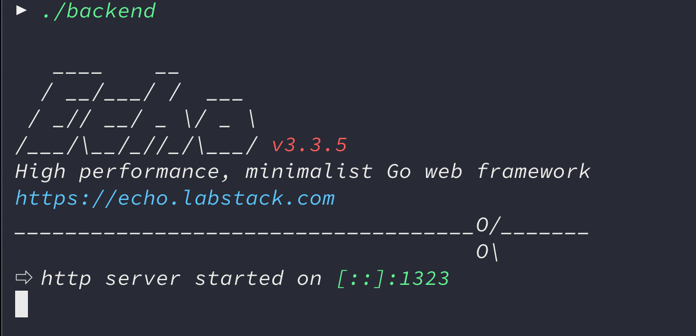

# 스타일쉐어 코딩 테스트 백엔드

> 랭킹 서비스 API 서버

### 사용법

먼저 `go` 언어 최신 버전(v1.11.4)을 다운로드해 주세요.

[download golang](https://golang.org/dl)

macOS 유저는 homebrew를 통해 설치 가능합니다.

```
$ brew update && brew upgrade
$ brew install golang
```

그 후, 저장소를 다운받은 뒤 디렉터리 안으로 들어가 파일을 빌드합니다.

```
$ cd backend
$ go get -u // 의존성 패키지 목록을 최신 버전으로 업데이트
$ go build
```

그러면 네이티브 바이너리 실행 파일이 생성됩니다. 곧장 실행해주세요.

```
$ ./backend
```

`http://localhost:1323` 포트로 서버가 실행되면 성공입니다.




### 기술 스택

- Go 1.11.4
- Echo framework
- Sqlite3
